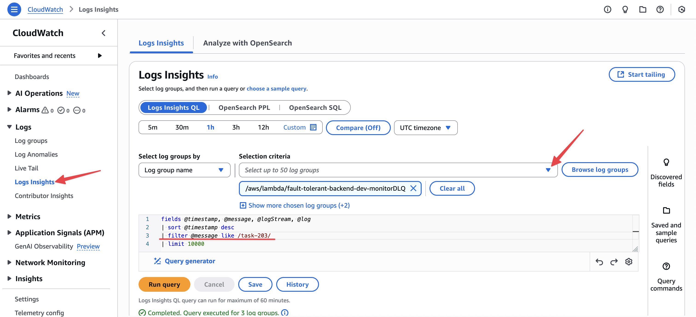

# Fault-Tolerant Backend System

A fault-tolerant backend system that processes tasks in an event-driven architecture, ensuring graceful handling of failures and retries using AWS services.

## Architecture Overview

The system consists of the following components:


- **API Gateway**: Accepts task submissions via POST /tasks
- **Main SQS Queue**: Handles task processing with retry capability
- **DLQ**: Captures failed tasks after maximum retries
- **Lambda Functions**:
  - `submitTask`: Accepts and queues new tasks
  - `processTask`: Processes tasks with simulated failures
  - `monitorDLQ`: Monitors and logs failed tasks

## Setup Instructions

1. Install dependencies:
   ```bash
   npm install
   ```

2. Configure Serverless Framework:
   - Open `serverless.yml`
   - Remove or update the following lines with your own Serverless Dashboard credentials (optional):
     ```yaml
     org: mptashyts           # Remove or replace with your org
     app: fault-tolerant-backend  # Remove or replace with your app name
     ```
   Note: These lines are only needed if you want to use the Serverless Dashboard features. The application will work without them.

3. Deploy the stack:
   ```bash
   npm run deploy
   ```

4. After deployment, note the API endpoint URL from the output. You'll need it for testing.

## Testing the System

1. Submit a task:
   ```bash
   curl -X POST https://your-api-endpoint/tasks -H "Content-Type: application/json" -d '{
     "taskId": "task123",
     "payload": {
       "data": "test data"
     }
   }'
   ```

   (or you can use the `dev.http` file)

2. Monitor CloudWatch logs to observe:
   - Go to CloudWatch Log Insights
   - Select the log group for the `fault-tolerant-backend` service
   - Run the following query:
     ```sql
     fields @timestamp, @message, @logStream, @log
      | sort @timestamp desc
      | filter @message like /task123/
      | limit 10000
     ```
   - Click "Run Query"
   - You should see the logs for the task you submitted

   

## Implementation Details

- Tasks have a 30% chance of failure
- Tasks with ID ending with 3 are permanently failed
- Failed tasks are retried twice with exponential backoff
- After 2 failed attempts, tasks are moved to DLQ
- DLQ messages are retained for 14 days
- All task processing events are logged to CloudWatch

## Assumptions

1. Task payloads are valid JSON objects

## Error Handling

- API validation for required fields
- SQS dead-letter queue for failed tasks
- Comprehensive error logging